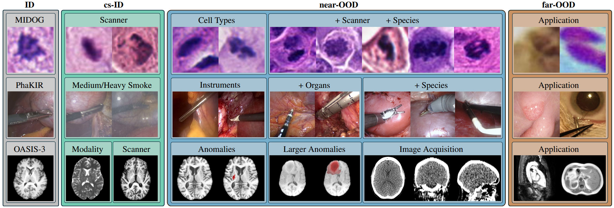

# OpenMIBOOD: Open Medical Imaging Benchmarks for Out-Of-Distribution Detection

| :exclamation: If you use OpenMIBOOD in your research, please cite our paper [OpenMIBOOD](https://arxiv.org/abs/2503.16247) along with both [OpenOOD](https://github.com/Jingkang50/OpenOOD) benchmarks (versions 1 and 1.5), from which this evaluation framework is forked.|
|-----------------------------------------|



| :exclamation: The table below lists all medical imaging datasets used in this framework. Each used dataset must be cited at a minimum. However, ensure compliance with its specific citation requirements to properly acknowledge the researchers' contributions.|
|-----------------------------------------|

---
## Supported Medical Imaging Benchmarks (3)
This part lists all benchmarks and their associated dataset structure.

<details open>
<summary><b>Medical Imaging Benchmarks</b></summary>

> - [x] [MIDOG](https://doi.org/10.1038/s41597-023-02327-4)
>      > ID: `Domain 1a`;<br>
>      > cs-ID: `Domain 1b`, `Domain 1c`;<br>
>      > near-OOD: `Domain 2`, `Domain 3`, `Domain 4`, `Domain 4`, `Domain 5`, `Domain 6a`, `Domain 6b`, `Domain 7`;<br>
>      > far-OOD: [`CCAgT`](https://doi.org/10.1016/j.compmedimag.2021.101934), [`FNAC2019`](https://doi.org/10.1016/j.tice.2019.02.001);
> - [x] [PhaKIR](https://phakir.re-mic.de/)
>      > ID: `Video 01 – 05`, `Video 07`; (without frames containing smoke) <br>
>      > cs-ID: `Video 01 – 05`, `Video 07`; (only frames containing smoke); <br>
>      > near-OOD: [`Cholec80`](https://doi.org/10.1109/TMI.2016.2593957), [`EndoSeg15`](https://doi.org/10.48550/arXiv.1805.02475), [`EndoSeg18`](https://doi.org/10.48550/arXiv.2001.11190);<br>
>      > far-OOD: [`Kvasir-SEG`](https://doi.org/10.1007/978-3-030-37734-2_37), [`CATARACTS`](https://doi.org/10.1016/j.media.2018.11.008);<br>
> - [x] [OASIS-3](https://sites.wustl.edu/oasisbrains/home/oasis-3/)
>      > ID: `T1-weighted MRI`; (without scans from Siemens MAGNETOM Vision devices)<br>
>      > cs-ID: `T2-weighted MRI`, `T1-weighted MRI` (only scans from Siemens MAGNETOM Vision devices);<br>
>      > near-OOD: [`ATLAS`](doi.org/10.1038/s41597-022-01401-7), [`BraTS-2023 Glioma`](https://doi.org/10.48550/arXiv.2107.02314), `OASIS-3 CT`;<br>
>      > far-OOD: [`MSD-H`](https://doi.org/10.1109/TMI.2015.2398818), [`CHAOS`](https://doi.org/10.1016/j.media.2020.101950);<br>
</details>

| :exclamation: The PhaKIR dataset is not yet publicly available (expected release: early summer).
Until then, we offer to evaluate post-hoc methods for this benchmark and provide the results.|
|-----------------------------------------|

The three Medical Imaging Benchmarks from [OpenMIBOOD](https://arxiv.org/abs/2503.16247) were evaluated using the following 24 post-hoc methods. 
While other postprocessors contained in this repository may also be compatible with these benchmarks, they have not been tested yet.

The evaluated methods include: [`ASH`](https://doi.org/10.48550/arXiv.2209.09858), [`DICE`](https://doi.org/10.1007%2F978-3-031-20053-3_40), [`Dropout`](https://proceedings.mlr.press/v48/gal16.html), [`EBO`](https://proceedings.neurips.cc/paper/2020/hash/f5496252609c43eb8a3d147ab9b9c006-Abstract.html), [`fDBD`](https://doi.org/10.48550/arXiv.2312.11536), [`GEN`](https://openaccess.thecvf.com/content/CVPR2023/html/Liu_GEN_Pushing_the_Limits_of_Softmax-Based_Out-of-Distribution_Detection_CVPR_2023_paper.html), [`KLM`](https://arxiv.org/abs/1911.11132v1), [`KNN`](https://proceedings.mlr.press/v162/sun22d.html), [`MDS`](https://proceedings.neurips.cc/paper/2018/hash/abdeb6f575ac5c6676b747bca8d09cc2-Abstract.html), [`MDS Ensemble`](https://proceedings.neurips.cc/paper/2018/hash/abdeb6f575ac5c6676b747bca8d09cc2-Abstract.html), [`MLS`](https://arxiv.org/abs/1911.11132v4), [`MSP`](https://doi.org/10.48550/arXiv.1610.02136), [`NNGuide`](https://openaccess.thecvf.com/content/ICCV2023/html/Park_Nearest_Neighbor_Guidance_for_Out-of-Distribution_Detection_ICCV_2023_paper.html), [`ODIN`](https://arxiv.org/abs/1706.02690v5), [`OpenMax`](https://www.cv-foundation.org/openaccess/content_cvpr_2016/html/Bendale_Towards_Open_Set_CVPR_2016_paper.html), [`RankFeat`](https://proceedings.neurips.cc/paper_files/paper/2022/hash/71c9eb0913e6c7fda3afd69c914b1a0c-Abstract-Conference.html), [`ReACT`](https://proceedings.neurips.cc/paper/2021/hash/01894d6f048493d2cacde3c579c315a3-Abstract.html), [`Relation`](https://proceedings.neurips.cc/paper_files/paper/2023/hash/886ed40d7882c9f891824e42a452c228-Abstract-Conference.html), [`Residual`](https://doi.org/10.48550/arXiv.2203.10807), [`RMDS`](https://doi.org/10.48550/arXiv.2106.09022), [`SCALE`](https://openreview.net/forum?id=RDSTjtnqCg), [`SHE`](https://openreview.net/forum?id=KkazG4lgKL), [`TempScale`](https://proceedings.mlr.press/v70/guo17a.html), [`ViM`](https://doi.org/10.48550/arXiv.2203.10807).

To reproduce our results, run the scripts `eval_ood_midog.py`, `eval_ood_phakir.py`, and `eval_ood_oasis3.py` from the [`scripts`](https://github.com/remic-othr/OpenMIBOOD/tree/main/scripts/download/OpenMIBOOD) directory, specifying the corresponding postprocessor method name as a parameter.

## Datasets (14)
For each dataset, a corresponding script is provided under [`scripts/download/OpenMIBOOD`](https://github.com/remic-othr/OpenMIBOOD/tree/main/scripts/download/OpenMIBOOD) that either downloads and prepares the dataset directly or gives instructions on how to proceed. For datasets that require a slightly more complex access, we prepared additional instructions under [`instructions/[dataset]`](https://github.com/remic-othr/OpenMIBOOD/tree/main/instructions/).

| Dataset | Associated Publications | Homepage |
| :-- | :-- | :-- |
| MIDOG | https://doi.org/10.1038/s41597-023-02327-4 | https://github.com/DeepMicroscopy/MIDOGpp |
| CCAgT | [https://doi.org/10.1016/j.compmedimag.2021.101934](https://doi.org/10.1016/j.compmedimag.2021.101934), https://doi.org/10.1109/CBMS49503.2020.00110 | https://github.com/johnnv1/CCAgT-utils |
| FNAC 2019 | https://doi.org/10.1016/j.tice.2019.02.001 | https://1drv.ms/u/s!Al-T6d-\_ENf6axsEbvhbEc2gUFs |
| PhaKIR | https://phakir.re-mic.de/ , [Smoke Annotations](https://opus4.kobv.de/opus4-oth-regensburg/home/index/language/language/en/rmodule/frontdoor/rcontroller/index/raction/index/docId/6080) | https://phakir.re-mic.de/  |
| Cholec80 | https://doi.org/10.1109/TMI.2016.2593957 | [Cropped single instrument frames from Cholec80](https://doi.org/10.5281/zenodo.14921670), [https://camma.unistra.fr/datasets/](https://camma.unistra.fr/datasets/) |
| EndoSeg15 | https://doi.org/10.48550/arXiv.1805.02475 | https://endovissub-instrument.grand-challenge.org/ |
| EndoSeg18 | https://doi.org/10.48550/arXiv.2001.11190 | https://endovissub2018-roboticscenesegmentation.grand-challenge.org/ |
| Kvasir-SEG | https://doi.org/10.1007/978-3-030-37734-2\_37 | https://datasets.simula.no/kvasir-seg/ |
| CATARACTS | https://doi.org/10.1016/j.media.2018.11.008 | [Cleaned subset of the first five CATARACTS test videos](https://doi.org/10.5281/zenodo.14924735), https://dx.doi.org/10.21227/ac97-8m18|
| OASIS-3 | https://doi.org/10.1101/2019.12.13.19014902 | https://sites.wustl.edu/oasisbrains/home/oasis-3/    |
| ATLAS | https://doi.org/10.1038/s41597-022-01401-7 | [https://fcon_1000.projects.nitrc.org/indi/retro/atlas.html](https://fcon_1000.projects.nitrc.org/indi/retro/atlas.html)    | 
| BraTS-Glioma | https://doi.org/10.48550/arXiv.2107.02314 | https://www.synapse.org/Synapse:syn51156910/wiki/621282    | 
| MSD-H | https://doi.org/10.1038/s41467-022-30695-9, https://doi.org/10.1038/s41467-022-30695-9 | http://medicaldecathlon.com/    |
| CHAOS | https://doi.org/10.1016/j.media.2020.101950 |  https://chaos.grand-challenge.org/Combined_Healthy_Abdominal_Organ_Segmentation/,   https://doi.org/10.5281/zenodo.3362844   | 

## Updates
- **14 Mar, 2025**: Repository corresponding to OpenMIBOOD released on github.
- **26 Feb, 2025**: OpenMIBOOD full paper is accepted at the CVPR 2025 conference. Check the report [here](https://arxiv.org/abs/2503.16247).

## Contributing
We appreciate all contributions to improve OpenMIBOOD.
However, we emphasize that this repository is merely an extension of the underlying OpenOOD framework; therefore, contributions may be more appropriately directed to the original [OpenOOD repository](https://github.com/Jingkang50/OpenOOD/blob/main/CONTRIBUTING.md).

## Get Started

### Installation
```
git clone https://github.com/remic-othr/OpenMIBOOD
cd OpenMIBOOD
pip install -e .
```

#### Data
To get all required datasets, you can use the provided download scripts in [`scripts/download/OpenMIBOOD`](https://github.com/remic-othr/OpenMIBOOD/tree/main/scripts/download/OpenMIBOOD).
After all datasets for a benchmark are prepared using those scripts, you can use the evaluation scripts `scripts/eval_ood_[benchmark].py`.

#### Pre-trained checkpoints
OpenMIBOOD uses three ID datasets and we release pre-trained models accordingly at https://doi.org/10.5281/zenodo.14982267.
However, for ease of access, you can use the download script [`download_classifiers.py`](https://github.com/remic-othr/OpenMIBOOD/tree/main/scripts/download/OpenMIBOOD) to automatically download and move the models to the correct folder.

Our codebase accesses the datasets from `./data/` and pretrained models from `./results/[benchmark]/` by default.
```
├── ...
├── data
│   ├── benchmark_imglist
│   ├── midog
|   ├── phakir
│   └── oasis
├── openood
├── results
│   ├── midog
|   ├── phakir
|   ├── oasis3
│   └── ...
├── scripts
```

#### Evaluation scripts
We provide evaluation scripts for all the methods we support in the [scripts](https://github.com/remic-othr/OpenMIBOOD/tree/main/scripts) folder: `eval_ood_midog.py`, `eval_ood_phakir.py`, `eval_ood_oasis3.py`.

---
<!-- ## Contributors
<a href="https://github.com/remic-othr/OpenMIBOOD/graphs/contributors">
  
</a> -->


## Citation
If you find our repository useful for your research, please consider citing our CVPR 2025 paper along with the original OpenOOD publications found at [Citation](https://github.com/Jingkang50/OpenOOD?tab=readme-ov-file#citation). 
Depending on which benchmarks/datasets you use, also give appropriate citations and credit to those researchers as outlined under [Datasets](#user-content-datasets)
```bibtex
# OpenMIBOOD
@inproceedings{gutbrod2025openmibood,
  author={Gutbrod, Max and Rauber, David and Nunes, Danilo Weber and Palm, Christoph},
  booktitle={{IEEE/CVF} Conference on Computer Vision and Pattern Recognition,
{CVPR} 2025, Nashville, TN, USA, June 11-15, 2025},
  publisher = {{IEEE}},
  title={OpenMIBOOD: Open Medical Imaging Benchmarks for Out-Of-Distribution Detection},
  year={2025}
}
```
