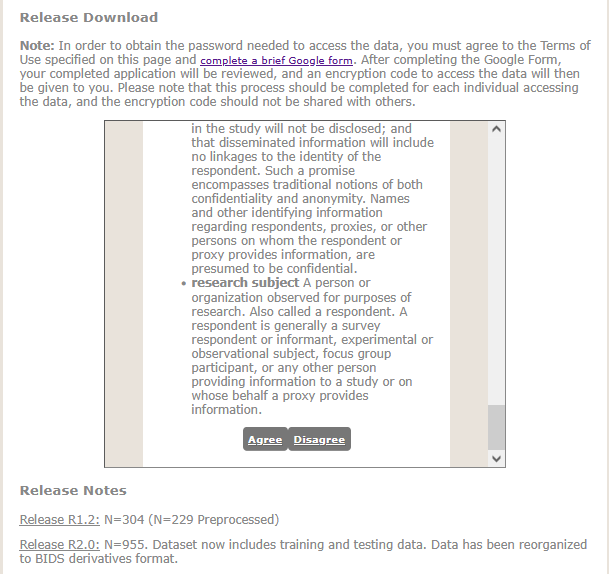
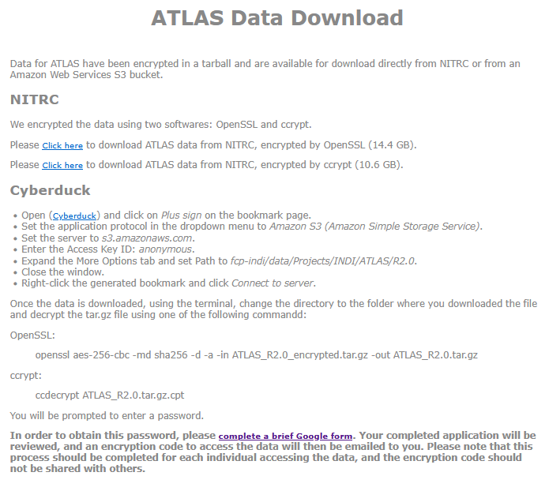

## Download instructions

To acquire the ATLAS data, please visit [ATLAS](https://fcon_1000.projects.nitrc.org/indi/retro/atlas.html) and agree to their terms of use.

Afterwards, follow the download instructions, which includes completing a brief Google form.

After filling out the brief [Google form](https://goo.gl/forms/KwCljKSLWbbHWalD2) you will acquire a decription key which can be used to decrypt the data as shown above. 

Lastly, place the decrypted "ATLAS_R2.0.tar.gz" in the directory of the ATLAS download script [`scripts/download/OpenMIBOOD`](https://github.com/remic-othr/OpenMIBOOD/scripts/download/OpenMIBOOD) and run `download_oasis3_atlas.py`.