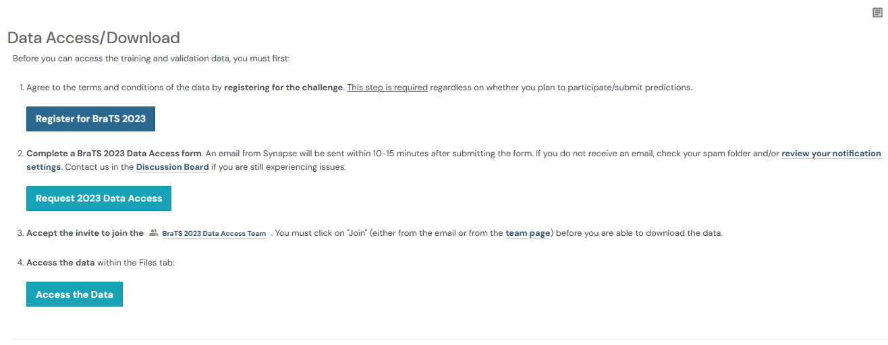
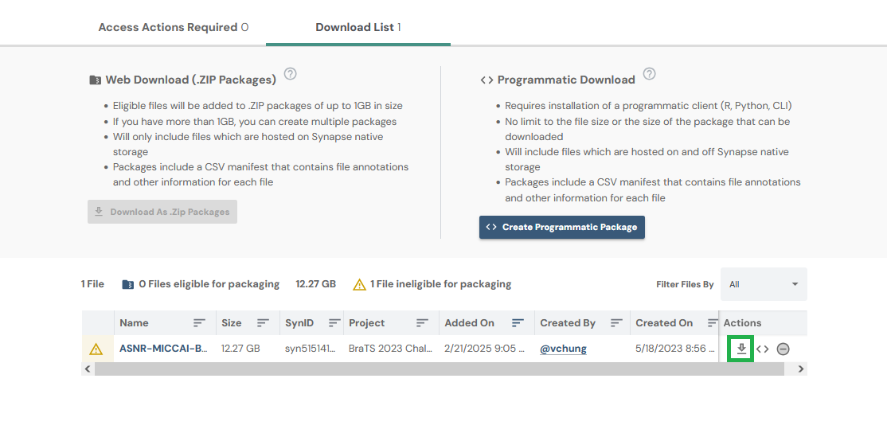

## Download instructions

To acquire the BraTS data, please register at [BraTS](https://www.synapse.org/Synapse:syn51156910/wiki/627000) and fill out the data access form.

After joining the data access team, download the "ASNR-MICCAI-BraTS2023-GLI-Challenge-TrainingData.zip" file.

            

  &darr;

The downloaded file needs to be placed in the directory of the BraTS download script [`scripts/download/OpenMIBOOD`](https://github.com/remic-othr/OpenMIBOOD/scripts/download/OpenMIBOOD) and run `download_oasis3_brats.py`.