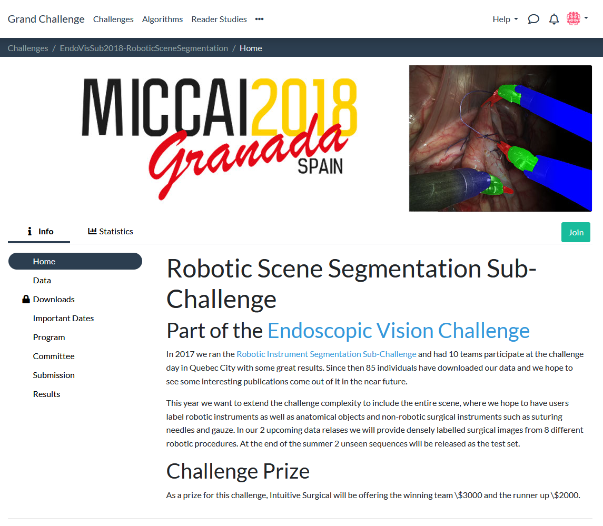
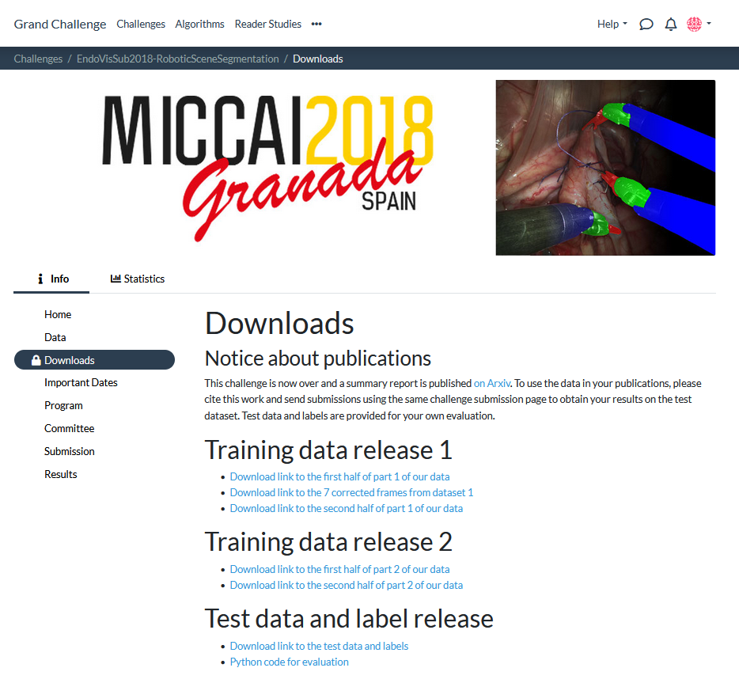

## Download instructions
To acquire the Endovis2018 data, please register an [account](https://endovissub2018-roboticinstrumentsegmentation.grand-challenge.org/) and join the challenge.

For the PhaKIR benchmark, only the test data is utilized.
Thus, after navigating to the downloads, select the download link to this data.

In google drive, download the test dataset consisting of the four sequences [seq_1, seq_2, seq_3, seq_4].

After the download is finished, you should have received two zip files. 
Rename them to Endovis2018_1.zip and Endovis2018_2.zip (it does not matter which downloaded file, gets which name) and place them in the directory of the Endovis2018 download script [`scripts/download/OpenMIBOOD`](https://github.com/remic-othr/OpenMIBOOD/scripts/download/OpenMIBOOD) and run `download_phakir_endovis2018.py`.