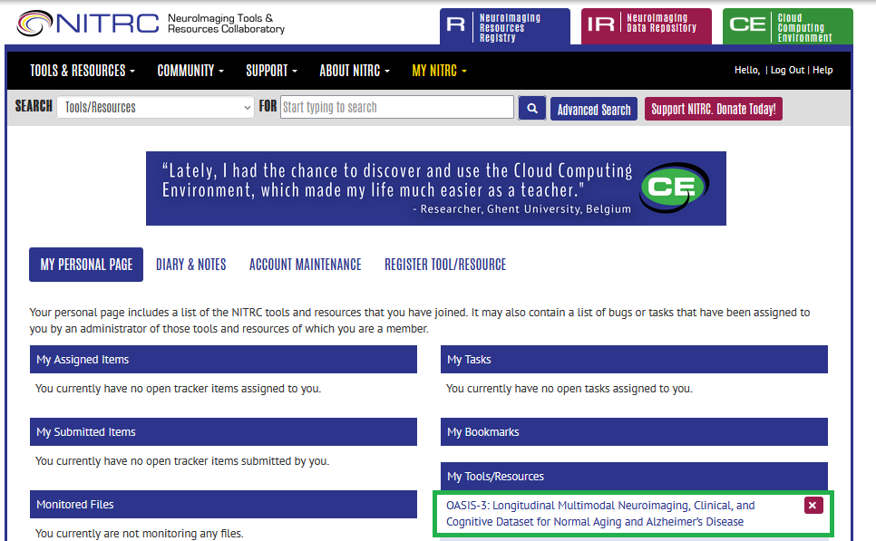
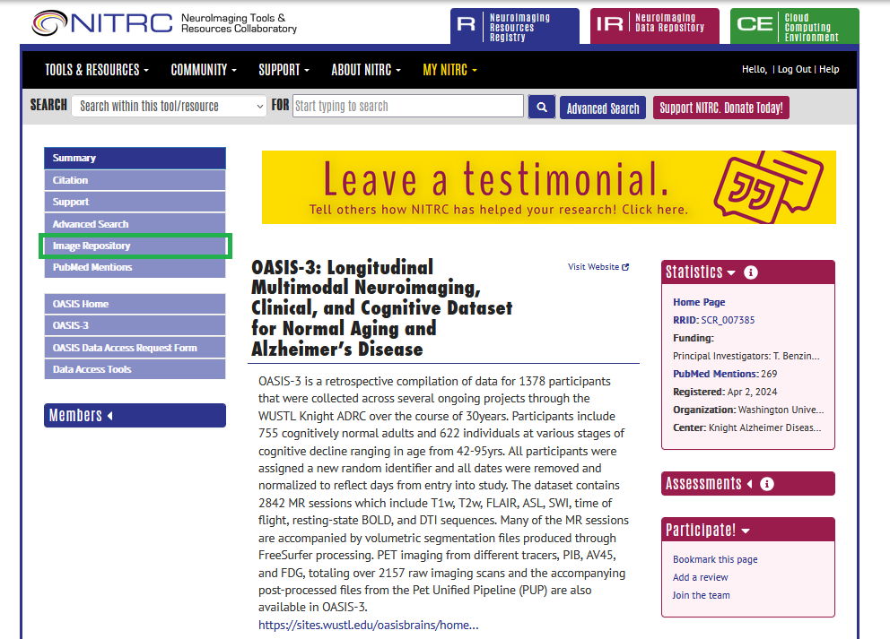
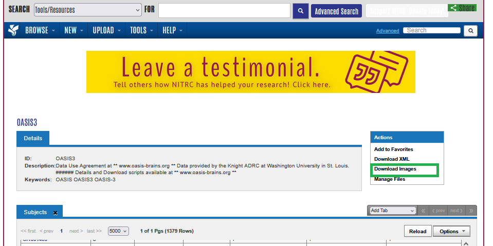
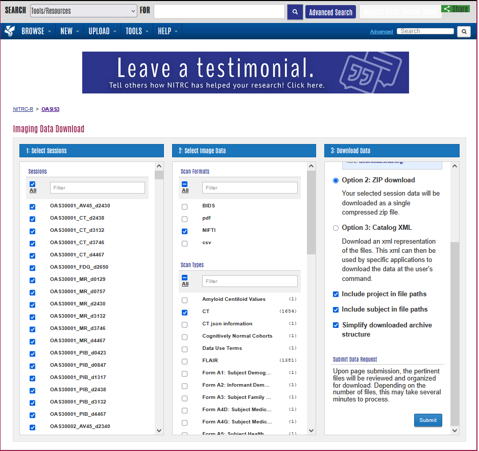
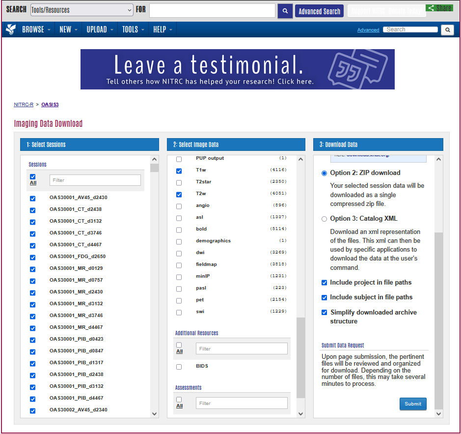

## Download instructions

<!-- print('To acquire the OASIS3 data, please request access at https://sites.wustl.edu/oasisbrains/home/access/. Only the access to OASIS-3: Longitudinal Multimodal Imaging is required.')
print('Continue to register a NITRC account using the same email at https://www.nitrc.org/account/register.php.')
print('After being granted access to the OASIS-3 data, log into your NITRC account and download the data.')
print('This process is not as straightforward as the other datasets, so please follow the instructions on the github repository.')
print('It comes down to selecting the following checkboxes: all sessions, T1w, T2w, and CT, download as zip archive, include project and subjects in file paths, simplify archive structure.')
print('After downloading the data, rename the resulting file to "OASIS3.zip", place it in the directory of this script and rerun it.')
print('Also, make sure that HD-BET (used for brain extraction) is installed (pip install hd-bet, to reproduce paper results, version 2.0.1 is required) and callable from the command line using "hd-bet".') -->

To acquire the OASIS-3 data, please first request [access](https://sites.wustl.edu/oasisbrains/home/access/). Only the access to 'OASIS-3: Longitudinal Multimodal Imaging' is required.

Continue to register a NITRC account using the same email at [NITRC](https://www.nitrc.org/account/register.php).

After being granted access to the OASIS-3 data, log into your NITRC account where you should see the OASIS-3 entry.

After selecting this entry, select 'Image Repository'.

Continue to 'Download Images'.

Here is the crucial step to get all the required data.
Select 'All' for sessions and only 'NIFTI' for 'Scan Formats'.
Further, select 'CT', 'T1w', and 'T2w' for 'Scan Types'.

Select 'Option 2: ZIP download' and (**very important**) check the boxes for **'Include project in file paths', 'Include subject in file paths', and 'Simplify downloaded archive structure',** as shown in the images above.

Finally click submit and wait for your download to be available.

After the download is finished, rename the resulting file to "OASIS3.zip", place it in the directory of the OASIS3 download script [`scripts/download/OpenMIBOOD`](https://github.com/remic-othr/OpenMIBOOD/scripts/download/OpenMIBOOD) and run `download_oasis3.py`.